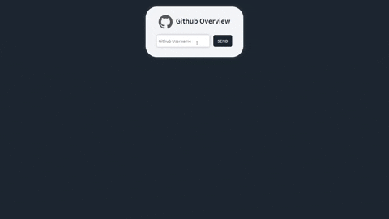

<h1 align="center">
  
  Github Overview 
  
</h1>

<h4 align="center">
  WebApp desenvolvida com Vue.js, que consome a API do Github para a exibição de perfil<br> de usuários e alguns de seus repositórios
</h4>

<p align="center">
  
  
</p>

<p align="center">
  <a href="#technologies">Tecnologias utilizadas</a>&nbsp;&nbsp;&nbsp;|&nbsp;&nbsp;&nbsp;
  <a href="#objective">Objetivo do projeto</a>&nbsp;&nbsp;&nbsp;|&nbsp;&nbsp;&nbsp;
  <a href="#final-result">Resultado final</a>&nbsp;&nbsp;&nbsp;|&nbsp;&nbsp;&nbsp;
  <a href="#how-to-use">Como rodar em sua máquina</a>
</p>

&nbsp;&nbsp;&nbsp;&nbsp;&nbsp;&nbsp;&nbsp;&nbsp;&nbsp;
&nbsp;&nbsp;&nbsp;&nbsp;&nbsp;&nbsp;&nbsp;&nbsp;&nbsp;
&nbsp;&nbsp;&nbsp;&nbsp;&nbsp;&nbsp;&nbsp;&nbsp;&nbsp;
&nbsp;&nbsp;&nbsp;&nbsp;&nbsp;&nbsp;&nbsp;&nbsp;&nbsp;
&nbsp;&nbsp;&nbsp;&nbsp;&nbsp;&nbsp;&nbsp;&nbsp;&nbsp;
&nbsp;&nbsp;&nbsp;&nbsp;&nbsp;

<h2 id="techonologies" name="technologies">
  :rocket:&nbsp;&nbsp;Tecnologias utilizadas
</h2>

- [Vue.js](https://br.vuejs.org) para a construção da aplicação como um todo
- [Sweet Alert](https://sweetalert.js.org/) para os alertas
- API do Github para obtenção dos dados

<h2 id="objective" name="objective">
  :dart:&nbsp;&nbsp;Objetivo do projeto
</h2>

Meu objetivo ao desenvolver esse projeto foi praticar os conceitos de Vue.js, tecnologia que comecei a aprender recentemente,
ao desenvolver essa aplicação, pude praticar e fixar conceitos como propriedades, componentes, eventos, e estilização(que não ficou
aquelas coisas, mas o que importa é o aprendizado), estou gostando muito de Vue e com certeza vou continuar incrementando meus conhecimentos
nessa tecnologia!

<h2 id="final-result" name="final-result">
  :clipboard:&nbsp;&nbsp;Resultado final
</h2>

### [Você pode ver o resultado final clicando aqui](https://github-overview-vue.herokuapp.com)

<h2 id="how-to-use" name="how-to-use">
  :information_source:&nbsp;&nbsp;&nbsp;&nbsp;Como rodar em sua máquina
</h2>

Siga os passos abaixo para rodar o projeto em sua máquina, antes de tudo, você precisa ter o Git, Node.js e o Yarn instalado em seu computador,
quando tiver eles instalados, siga os seguintes passos:

```bash
# Clone o repositório em algum diretório de seu computador
$ git clone https://github.com/TiagoDiass/github-overview.git

# Entre no repositório
$ cd github-overview

# Instale as dependências
$ yarn

# Inicie o servidor
$ yarn serve
```

Após seguir estes passos, o terminal mostrará em qual porta ele está rodando, geralmente é na 8080, logo, basta entrar
em seu navegador e digitar `localhost:8080`, e você entrará na aplicação, quando quiser pará-la basta ir no terminal que você a iniciou
e digitar <kbd>CTRL</kbd>+<kbd>C</kbd>, assim ela será parada e você sairá do modo de desenvolvimento

---

Espero que tenha gostado do projeto :smiley:<br>
:wave: [Entre em contato!](https://www.linkedin.com/in/tiagodiass)

### Autor: Tiago Dias


